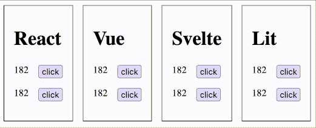

# Yet Another Clean Architecture Frontend Test

## Goal

The goal of this project is to POC a simple
"clean"/"hexagonal" architecture inspired project but in
the context of a SPA.

There are some talks and articles availables on the subject,
but I felt like those were not elaborated enough.
Or, much worst, used React primitives as a domain models,
which contradict the benefits of this kind of architecture.

Also, I wanted something really simple,
just enough to POC the possibility of such architecture in this context.

The frontend is available in :

- React
- Vue
- Svelte
- Lit

There is a synchronisation mecanism between all those UI implementations, to show that it's just the front part:

## Architecture

The system works with an event system:

- the domain entities are gathered via a `Repository`
- An Application Service contains the use cases of the application and makes the plumbing (equivalent to the Application layer in Clean Architecture)
- an Observer (`Presenter`) execute a callback to notify the frontend framework that a change happened. The callback takes a `ViewModel` in parameter.
- The callback is created by the frontend and is responsible to change the UI state.

Some notes about the project structure:
- All the front parts are in `src/counter/presentation`
- There is no injection mecanism : global objets are in the `src/counter/configuration` file and are just imported. 
- You can switch between a `InMemoryRepository` and a `LocalStorageRepository` implementation

## Conclusion

It works !

The less painful experience were with `Vue` and `Svelte`.

I had some problems with the `Lit` but nothing too problematic (`this` binding, decorators).

However, the one-way binding of `React` made me use `useReducer` instead of plain `useState`.

## Limitation

My goals was to test multiple frontend frameworks. However, I gave up for `Angular` because it was not compatible with `Vite`.

I also wonder if this architecture could cause performance issues at scale.
